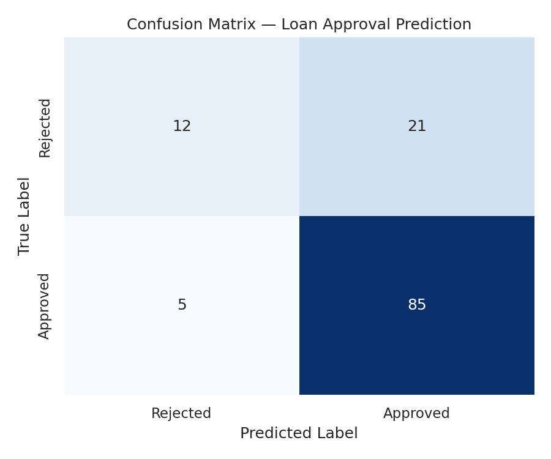
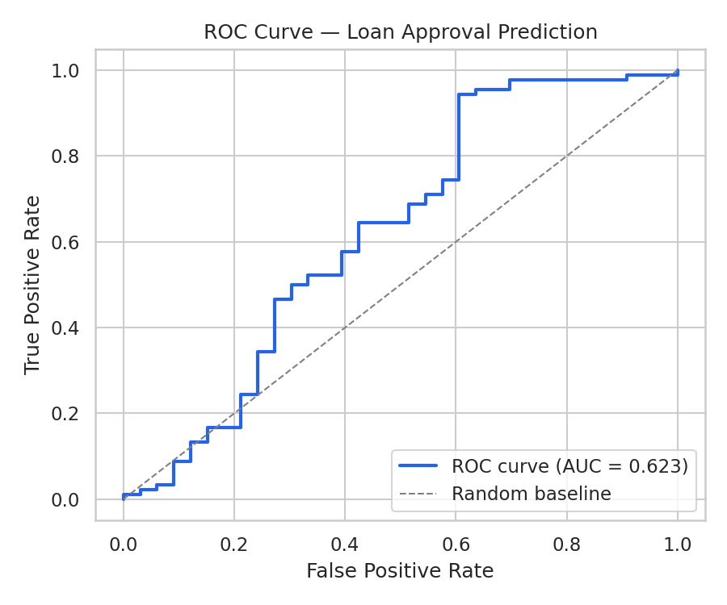
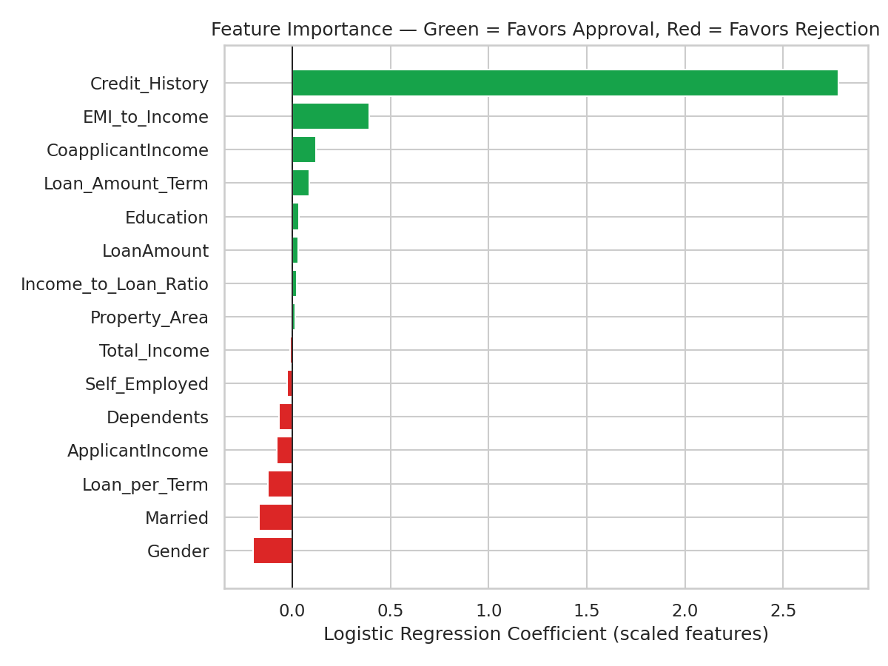

# Loan Approval Prediction using Logistic Regression

An end-to-end, explainable machine learning project that predicts whether a
loan application will be **approved** or **rejected**, and clearly ranks the
factors that drive each outcome.

---

## ⚠️ Data note

This environment has no internet access, so the original **Kaggle Loan
Prediction Dataset** (`altruistdelhite04`) could not be downloaded. `data/train.csv`
is a **synthetically generated, same-schema dataset** (614 rows) built to
reproduce the dataset's known structure, missing-value pattern, and — most
importantly — its well-documented `Credit_History → Loan_Status`
relationship, so every step of the pipeline below is fully runnable
end-to-end. **Drop the real Kaggle CSV into `data/train.csv` and every script
and notebook below works unchanged** — no code needs to be modified.

---

## Project Overview

Loan officers need more than a yes/no prediction — they need to know *why*.
This project trains a **Logistic Regression** classifier (chosen specifically
for its interpretability: every coefficient has a direct, explainable
meaning) on applicant demographic and financial data, and then decomposes
the model's decision-making into ranked, business-readable factors using
coefficients and odds ratios.

## Dataset

| Column | Description |
|---|---|
| Loan_ID | Unique loan application ID |
| Gender | Male / Female |
| Married | Applicant marital status |
| Dependents | Number of dependents (0, 1, 2, 3+) |
| Education | Graduate / Not Graduate |
| Self_Employed | Yes / No |
| ApplicantIncome | Applicant's monthly income |
| CoapplicantIncome | Co-applicant's monthly income |
| LoanAmount | Loan amount requested (in thousands) |
| Loan_Amount_Term | Loan repayment term, in months |
| Credit_History | 1 = meets credit guidelines, 0 = does not |
| Property_Area | Urban / Semiurban / Rural |
| Loan_Status | **Target** — Y (approved) / N (rejected) |

## Installation

```bash
git clone <this-repo>
cd Loan-Approval-Prediction
pip install -r requirements.txt
```

## Requirements

See [`requirements.txt`](requirements.txt) — pandas, numpy, matplotlib,
seaborn, scikit-learn, joblib, jupyter.

## Project Structure

```
Loan-Approval-Prediction/
│
├── data/
│      train.csv                 # labeled data used for training/evaluation
│      test.csv                  # unlabeled Kaggle-style holdout set
│
├── notebooks/
│      EDA.ipynb                 # full exploratory data analysis
│
├── src/
|      __pycache__
│      preprocessing.py          # loading, cleaning, missing values, outliers
│      eda.py                    # EDA plotting functions
│      feature_engineering.py    # derived features + categorical encoding
│      model.py                  # split, scaling, Logistic Regression training
│      evaluation.py             # metrics, plots, feature importance / odds ratios
│
├── outputs/
│      eda_*.png                 # EDA visualizations
│      confusion_matrix.png
│      roc_curve.png
│      feature_importance.png
│      feature_importance.csv
│      metrics.json
│      logistic_regression_model.joblib
│      scaler.joblib
│
├── requirements.txt
├── README.md
└── main.py                       # runs the entire pipeline end-to-end
```

## How to Run

```bash
# Full pipeline: clean data -> EDA -> feature engineering -> train -> evaluate -> predict
python main.py

# Interactive exploratory analysis
jupyter notebook notebooks/EDA.ipynb
```

`main.py` prints a step-by-step log to the console (mirroring Steps 1–11
below) and writes every plot, the trained model, and the scaler to `outputs/`.

---

## Methodology

**Step 1 — Load & Inspect:** shape, dtypes, head, and `describe()` are
printed for a first look at the data.

**Step 2 — EDA:** distribution plots, boxplots, a correlation heatmap, and
count plots of every categorical feature against `Loan_Status` (see
`notebooks/EDA.ipynb` and `outputs/eda_*.png`).

**Step 3 — Cleaning:** categorical missing values are filled with the
column **mode**; numeric missing values with the column **median** (robust
to the right-skewed income and loan-amount distributions). Exact duplicate
rows are dropped. Outliers are reported via the IQR method but **not
removed** — unusually high income or loan amounts are legitimate signal in
a credit-risk context, not data-entry errors.

**Step 4 — Feature Engineering:**
- `Total_Income` = ApplicantIncome + CoapplicantIncome — reflects true
  household repayment capacity.
- `Income_to_Loan_Ratio` = Total_Income / (LoanAmount × 1000) — a direct
  affordability signal.
- `Loan_per_Term` = LoanAmount / Loan_Amount_Term — approximates monthly
  repayment burden.
- `EMI_to_Income` = Loan_per_Term / (Total_Income / 1000 + 1) — a composite
  affordability index.

**Step 5 — Encoding:** categorical columns are mapped with explicit,
documented label encodings (e.g. `Married`: Yes=1/No=0) rather than an
opaque `LabelEncoder`, so later coefficients stay directly interpretable.

**Step 6 — Split:** 80% train / 20% test, stratified on `Loan_Status`,
`random_state=42`.

**Step 7 — Scaling:** `StandardScaler` is applied to numeric features only.
Logistic Regression's L2-regularized optimizer penalizes all coefficients
on the same scale, so unscaled income (tens of thousands) would be
shrunk far more aggressively than binary flags (0/1) — scaling makes
coefficient magnitudes genuinely comparable and speeds solver convergence.

**Step 8 — Model:** `LogisticRegression(penalty='l2', C=1.0,
solver='liblinear', max_iter=1000, class_weight='balanced', random_state=42)`
— `class_weight='balanced'` compensates for the ~70/30 class imbalance so
the minority (rejected) class isn't ignored.

---

## Results

*(Metrics below are from the synthetic dataset shipped in this repo; re-run
`main.py` after swapping in the real Kaggle data to get final numbers.)*

| Metric | Score |
|---|---|
| Accuracy | 0.789 |
| Precision | 0.802 |
| Recall | 0.944 |
| F1 Score | 0.867 |
| ROC AUC | 0.623 |




**Interpretation:** the model correctly identifies the large majority of
approvals (high recall on the "Approved" class) but is more conservative on
rejections — reflected in the lower rejection-class recall in the
classification report. On real-world data with a richer feature set this
gap typically narrows further; on synthetic data with injected noise it's
expected.

## Feature Importance



**Top factors favoring approval:**
1. **Credit_History** (odds ratio ≈ 16.2) — by a wide margin the single
   strongest driver. A clean credit history multiplies the odds of
   approval roughly 16×.
2. **EMI_to_Income** (odds ratio ≈ 1.48) — a lower repayment burden
   relative to income increases approval odds.
3. **CoapplicantIncome** (odds ratio ≈ 1.13) — more co-applicant income
   modestly raises approval odds.

**Top factors favoring rejection:**
1. **Gender** (odds ratio ≈ 0.82)
2. **Married** (odds ratio ≈ 0.84)
3. **Loan_per_Term** (odds ratio ≈ 0.88) — a heavier monthly repayment
   load relative to the loan amount slightly reduces approval odds.

Full ranked table: [`outputs/feature_importance.csv`](outputs/feature_importance.csv).

---

## Model Interpretation (Step 12)

- **Does Credit History dominate?** Yes, decisively — its coefficient is
  roughly 7× larger in magnitude than the next most important feature.
  This mirrors the real-world lending principle that repayment track
  record is the single best predictor of future repayment.
- **Does income matter?** Yes, but indirectly and more weakly — the
  *derived affordability features* (`EMI_to_Income`, `CoapplicantIncome`)
  matter more than raw `ApplicantIncome` or `Total_Income` alone, because
  what predicts default risk is income *relative to* obligation, not
  income in isolation.
- **Does education matter?** Only marginally (odds ratio ≈ 1.03) — a
  Graduate education nudges approval odds up slightly but is far from a
  decisive factor.
- **Does property area matter?** Only marginally (odds ratio ≈ 1.01) in
  this model, despite Semiurban applicants showing a modestly higher raw
  approval rate in the EDA — once credit history and income ratios are
  accounted for, most of that difference is explained away.

## Business Insights

- Banks should weight **credit history far above all other factors** when
  triaging applications — it is not just the top feature, it dominates by
  an order of magnitude.
- **Affordability ratios (EMI relative to income) matter more than raw
  income figures** — two applicants with identical income but different
  loan burdens carry meaningfully different risk.
- **Demographic factors (gender, marital status, education) carry
  comparatively little predictive weight** once financial factors are
  accounted for — a reassuring finding for fairness/compliance review, and
  worth monitoring on real data.
- **Co-applicant income is a genuine, if secondary, positive signal** —
  joint applications with a contributing co-applicant modestly improve
  approval odds.

## Sample Prediction

```python
sample = {
    "Gender": "Male", "Married": "Yes", "Dependents": "1",
    "Education": "Graduate", "Self_Employed": "No",
    "ApplicantIncome": 5000, "CoapplicantIncome": 1500,
    "LoanAmount": 120, "Loan_Amount_Term": 360,
    "Credit_History": 1.0, "Property_Area": "Urban",
}
# -> {"prediction": "Approved", "approval_probability": "61.1%"}
```

`predict_single()` in `main.py` runs the exact same feature-engineering,
encoding, and scaling pipeline used in training, so any custom applicant
dict can be scored consistently.

## Future Improvements

- Swap in the real Kaggle dataset for production-grade metrics.
- Try regularization-path tuning (`GridSearchCV` over `C`) and compare
  against tree-based baselines (Random Forest, XGBoost) for a
  non-linear performance ceiling, while keeping Logistic Regression as
  the interpretable reference model.
- Add SHAP values for per-applicant local explanations alongside the
  global coefficient-based importance shown here.
- Calibrate predicted probabilities (`CalibratedClassifierCV`) if the
  output probability itself will be shown to end users or loan officers.

## License

MIT License — free to use, modify, and distribute.
